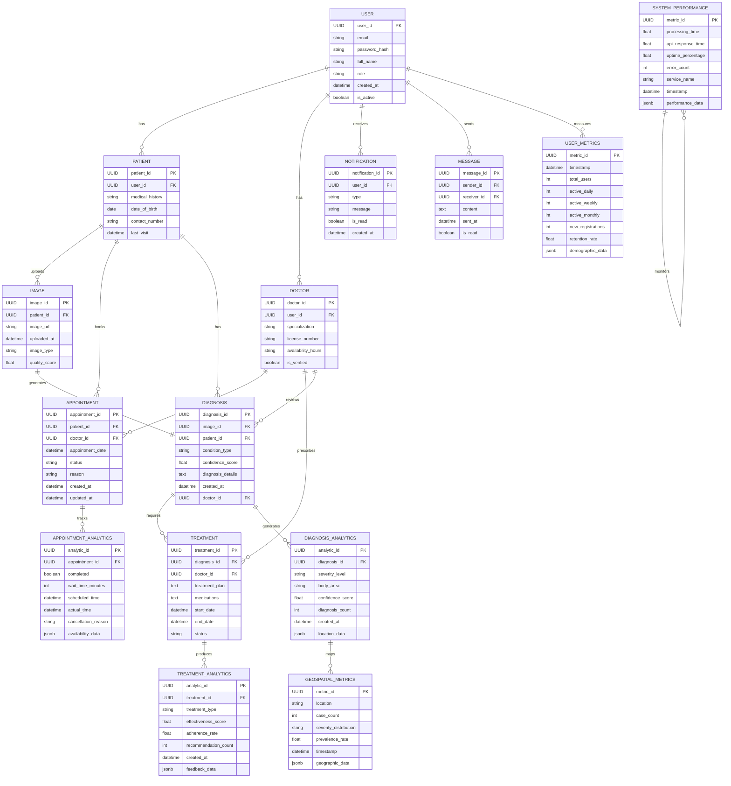

# Entity Relationship Diagram - Eczema Diagnosis and Advisory System

## Entity Descriptions

### USER
- Central entity for authentication and basic user information
- Supports multiple roles (patient, doctor, admin)
- Tracks account status and creation time

### PATIENT
- Extends USER for patient-specific information
- Stores medical history and contact details
- Links to appointments and diagnoses

### DOCTOR
- Extends USER for healthcare provider information
- Includes verification and licensing details
- Manages appointments and treatments

### IMAGE
- Stores uploaded skin condition images
- Tracks image quality and metadata
- Links to diagnoses

### DIAGNOSIS
- Records AI and doctor-reviewed diagnoses
- Includes confidence scores and detailed analysis
- Links to treatments and follow-ups

### APPOINTMENT
- Manages patient-doctor consultations
- Tracks scheduling and status
- Includes reason and updates

### TREATMENT
- Details prescribed treatment plans
- Tracks medications and duration
- Monitors treatment progress

### NOTIFICATION
- Handles system notifications
- Supports multiple notification types
- Tracks read status

### MESSAGE
- Enables secure communication
- Supports patient-doctor messaging
- Tracks message status

### USER_METRICS
- Tracks user engagement metrics
- Stores demographic information
- Monitors retention rates
- Records user growth trends

### DIAGNOSIS_ANALYTICS
- Records diagnosis patterns
- Tracks severity distributions
- Maps affected body areas
- Stores confidence scores

### TREATMENT_ANALYTICS
- Monitors treatment effectiveness
- Tracks patient adherence
- Records recommendation patterns
- Stores feedback data

### APPOINTMENT_ANALYTICS
- Tracks appointment completion
- Monitors wait times
- Records scheduling patterns
- Analyzes provider availability

### SYSTEM_PERFORMANCE
- Measures processing times
- Monitors API performance
- Tracks system reliability
- Records error patterns

### GEOSPATIAL_METRICS
- Maps case distributions
- Tracks regional patterns
- Monitors prevalence rates
- Stores location-based insights

## Relationships

1. One USER can be either a PATIENT or DOCTOR
2. PATIENT can upload multiple IMAGEs
3. Each IMAGE generates one DIAGNOSIS
4. DOCTORs can review multiple DIAGNOSEs
5. DIAGNOSIS can have multiple TREATMENTs
6. PATIENTs and DOCTORs can schedule multiple APPOINTMENTs
7. USERs can send and receive multiple MESSAGEs
8. USERs can receive multiple NOTIFICATIONs
9. DIAGNOSIS generates DIAGNOSIS_ANALYTICS
10. TREATMENT produces TREATMENT_ANALYTICS
11. APPOINTMENT tracks APPOINTMENT_ANALYTICS
12. USER measures USER_METRICS
13. SYSTEM_PERFORMANCE monitors SYSTEM_PERFORMANCE
14. DIAGNOSIS_ANALYTICS maps GEOSPATIAL_METRICS
