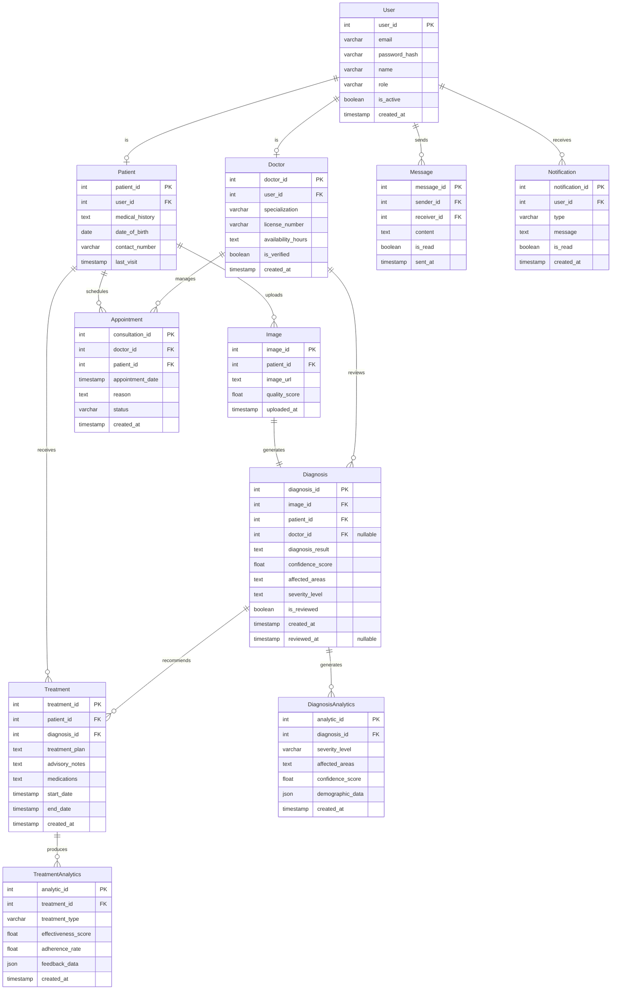

# Entity Relationship Diagram - Eczema Diagnosis and Advisory System

# Entity Relationship Diagram Documentation

## Overview
This ERD represents the complete database structure for the Eczema Diagnosis and Advisory System, including all core functionalities specified in the SDD document.

## Entities

### User
- Base entity for authentication and authorization
- Supports multiple roles (patient, doctor)
- Manages account status and security

### Patient
- Extends User for patient-specific information
- Stores medical history and contact details
- Tracks visits and appointments

### Image
- Stores uploaded skin images
- Contains quality metrics and metadata
- Links to diagnostic results

### Diagnosis
- Stores ML model diagnosis results
- Contains confidence scores and severity levels
- Can be reviewed by doctors
- Links images to treatments
- Tracks affected areas and review status

### Appointment
- Manages consultations between patients and doctors
- Contains scheduling information and status
- Tracks appointment reasons and history

### Treatment
- Stores treatment plans and medications
- Connected to specific diagnoses
- Includes advisory notes and duration

### Doctor
- Extends User for healthcare provider information
- Manages professional credentials
- Tracks availability and verification status

### Message
- Enables secure communication between users
- Tracks message status and history
- Supports patient-doctor interactions

### Notification
- Manages system notifications
- Supports multiple notification types
- Tracks read status

### DiagnosisAnalytics
- Tracks diagnostic patterns and trends
- Stores demographic information
- Monitors severity distributions

### TreatmentAnalytics
- Analyzes treatment effectiveness
- Tracks patient adherence
- Records feedback and outcomes

## Relationships

1. User to Patient/Doctor (1:0/1)
   - Each User can be either a Patient or Doctor
   - Enables role-based access control

2. Patient to Image (1:Many)
   - One patient can upload multiple images
   - Each image belongs to one patient

3. Image to Diagnosis (1:1)
   - Each image generates one diagnosis
   - Each diagnosis is associated with one image

4. Diagnosis to Treatment (1:Many)
   - One diagnosis can have multiple treatment plans
   - Each treatment is linked to one diagnosis

5. Doctor to Diagnosis (1:Many)
   - One doctor can review multiple diagnoses
   - Each reviewed diagnosis is linked to one doctor

6. User to Message (1:Many)
   - Users can send and receive multiple messages
   - Each message has one sender and one receiver

7. User to Notification (1:Many)
   - Users can receive multiple notifications
   - Each notification belongs to one user

8. Diagnosis/Treatment to Analytics (1:Many)
   - Each diagnosis/treatment generates analytics
   - Analytics track patterns and effectiveness
