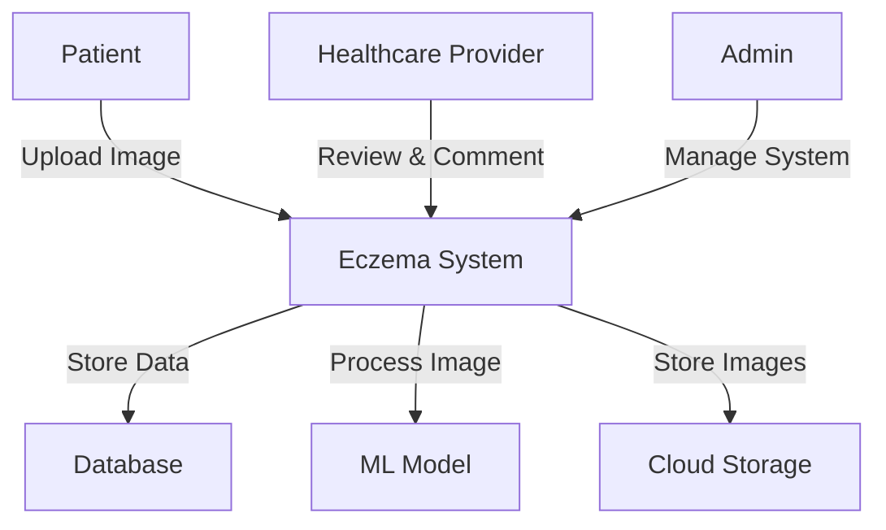
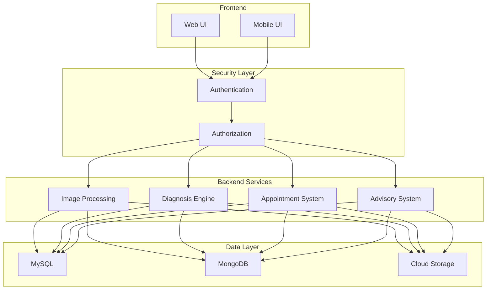
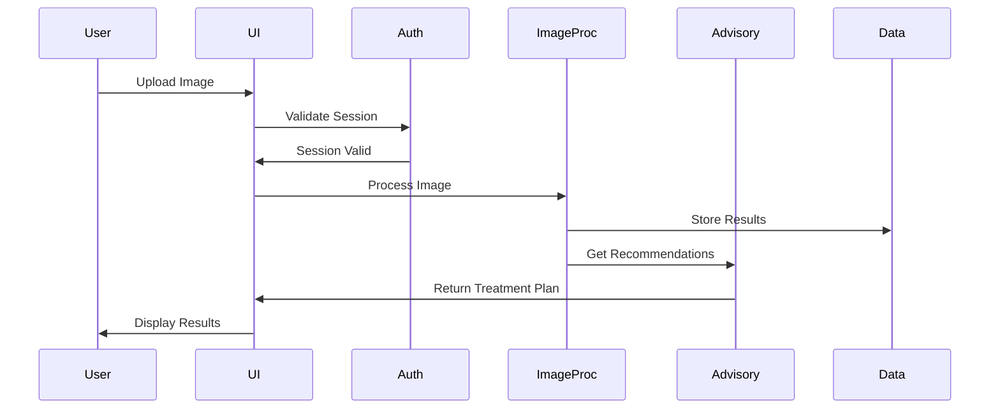
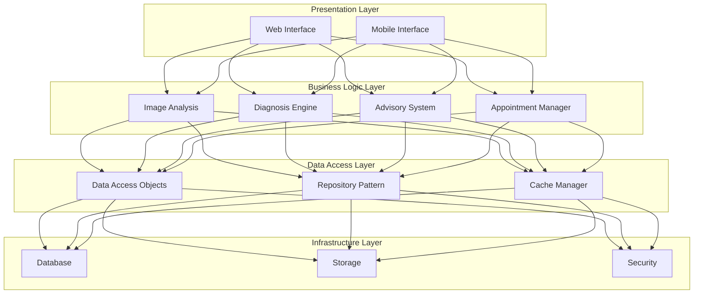
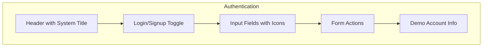
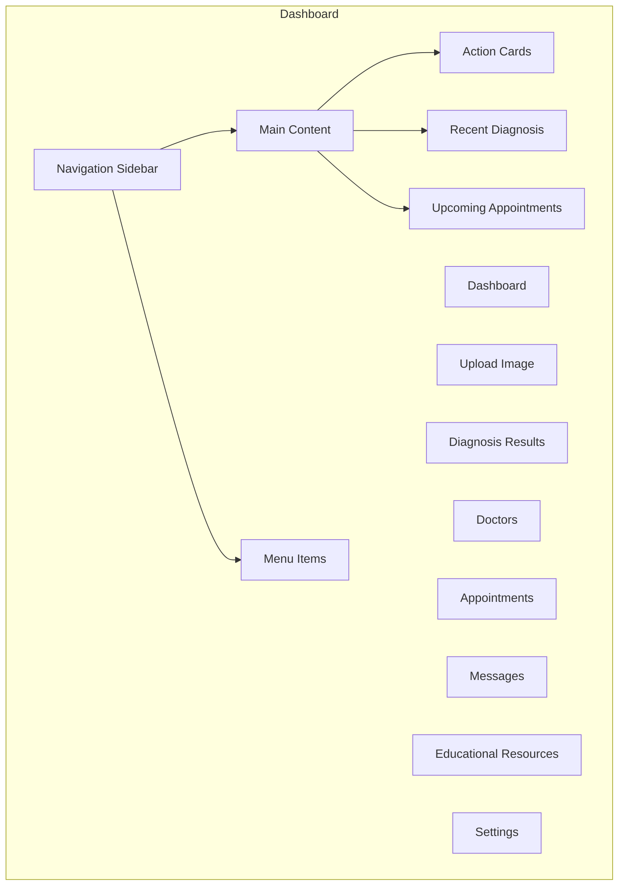
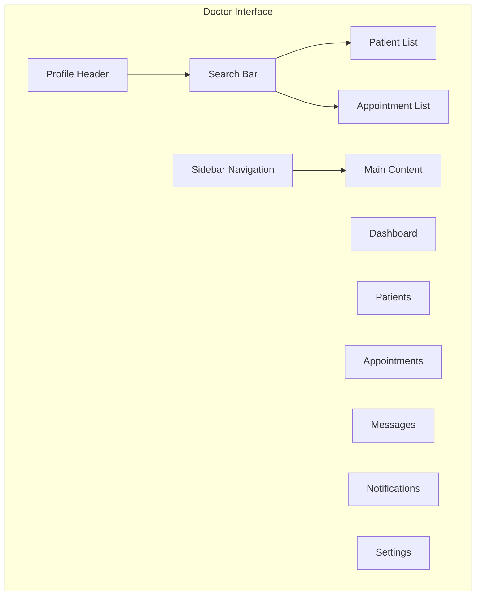

# BSE25-10
# Eczema Diagnosis and Advisory System
# Software Design Document

**Names:** NALUGYA MERISA, MUKISA VANIAH CHRISTIAN, AHEEBWOMUGISHA SASHA ANA, ACAN BRENDA  
**Lab Section:** BSE25-10  
**Workstation:** N/A  
**Date:** 02/01/2025

## Table of Contents
1. [Introduction](#1-introduction)
   1. [Purpose](#11-purpose)
   2. [Scope](#12-scope)
   3. [Overview](#13-overview)
   4. [Reference Material](#14-reference-material)
   5. [Definitions and Acronyms](#15-definitions-and-acronyms)
2. [System Overview](#2-system-overview)
3. [System Architecture](#3-system-architecture)
   1. [Architectural Design](#31-architectural-design)
   2. [Decomposition Description](#32-decomposition-description)
   3. [Design Rationale](#33-design-rationale)
4. [Data Design](#4-data-design)
   1. [Data Description](#41-data-description)
   2. [Data Dictionary](#42-data-dictionary)
5. [Component Design](#5-component-design)
6. [Human Interface Design](#6-human-interface-design)
   1. [Overview of User Interface](#61-overview-of-user-interface)
   2. [Screen Images](#62-screen-images)
   3. [Screen Objects and Actions](#63-screen-objects-and-actions)
7. [Requirements Matrix](#7-requirements-matrix)
8. [Appendices](#8-appendices)
9. [Analytics and Reporting](#9-analytics-and-reporting)

## 1. Introduction

### 1.1 Purpose
This software design document describes the architecture and system design of the Eczema Diagnosis and Advisory System. The intended audience for this document includes:
- Development team
- Project stakeholders
- Healthcare professionals
- System maintainers
- Quality assurance team

### 1.2 Scope
The Eczema Diagnosis and Advisory System aims to assist patients in diagnosing and managing eczema through:
- AI-powered image analysis
- Treatment recommendations
- Healthcare professional consultation
- Patient education and monitoring

**Goals:**
- Facilitate accurate eczema diagnosis
- Reduce treatment costs
- Improve healthcare accessibility
- Enable patient-doctor communication

**Objectives:**
- Implement ML-based image analysis
- Provide treatment recommendations
- Enable appointment scheduling
- Ensure data security and privacy

### 1.3 Overview
This SDD is organized into nine main sections:
1. Introduction - Document purpose and scope
2. System Overview - General functionality description
3. System Architecture - System structure and components
4. Data Design - Data structures and organization
5. Component Design - Detailed component descriptions
6. Human Interface Design - UI/UX specifications
7. Requirements Matrix - Requirements traceability
8. Appendices - Supporting documentation
9. Analytics and Reporting - System analytics and reporting framework

### 1.4 Reference Material
1. IEEE 1016-2009 - Software Design Descriptions
2. HIPAA Security Rule Requirements
3. GDPR Technical Guidelines
4. HL7 FHIR Standards for Healthcare Data Exchange
5. TensorFlow Documentation for Image Analysis

### 1.5 Definitions and Acronyms
- **API**: Application Programming Interface
- **CRUD**: Create, Read, Update, Delete
- **HIPAA**: Health Insurance Portability and Accountability Act
- **JWT**: JSON Web Token
- **ML**: Machine Learning
- **REST**: Representational State Transfer
- **UI/UX**: User Interface/User Experience

## 2. System Overview

### 2.1 System Context Diagram



### 2.2 System Dependencies

1. External Services
   - Google Cloud Platform
   - TensorFlow Model Server
   - OAuth 2.0 Authentication
   - SMS Gateway for Notifications

2. Third-Party Libraries
   - React.js 18.0
   - TensorFlow.js 2.x
   - Material-UI 5.x
   - MongoDB Driver 5.0

### 2.3 System Constraints

1. Technical Constraints
   - Mobile app limited to Android platform
   - Image size limit: 10MB
   - Maximum concurrent users: 500

2. Business Constraints
   - HIPAA compliance requirements
   - Data retention policies
   - User data privacy regulations

## 3. System Architecture

### 3.1 Architectural Overview

The Eczema Diagnosis and Advisory System employs a modular architectural style, dividing the system into independent, self-contained modules. This approach enables:
- Loose coupling between components
- High cohesion within modules
- Scalable and maintainable codebase
- Clear separation of concerns

#### System Architecture Diagram



### 3.2 High-Level Subsystems

#### 1. User Interface (UI) Subsystem
- **Responsibilities:**
  - Profile management
  - Image upload interface
  - Diagnosis results display
  - Appointment scheduling
- **Technologies:**
  - React.js for web
  - React Native for mobile
  - Material-UI components

#### 2. Image Processing and Diagnosis Subsystem
- **Responsibilities:**
  - Image preprocessing
  - ML model inference
  - Confidence score calculation
- **Technologies:**
  - TensorFlow for ML
  - OpenCV for image processing
  - GPU acceleration support

#### 3. Healthcare Appointment Subsystem
- **Responsibilities:**
  - Appointment scheduling
  - Calendar management
  - Notification system
- **Technologies:**
  - Calendar API integration
  - Real-time updates
  - SMS/Email notifications

#### 4. Advisory and Treatment Subsystem
- **Responsibilities:**
  - Treatment recommendations
  - Lifestyle suggestions
  - Research-based insights
- **Technologies:**
  - Knowledge base system
  - Rule engine
  - Content management system

#### 5. Data Management Subsystem
- **Responsibilities:**
  - Data persistence
  - Backup management
  - Data encryption
- **Technologies:**
  - MySQL for structured data
  - MongoDB for unstructured data
  - Google Cloud Storage

#### 6. Authentication and Security Subsystem
- **Responsibilities:**
  - User authentication
  - Access control
  - Data protection
- **Technologies:**
  - OAuth 2.0
  - JWT tokens
  - AES-256 encryption

### 3.3 Subsystem Interactions



### 3.4 Design Rationale

#### Architecture Selection Criteria
1. **Scalability**
   - Independent scaling of subsystems
   - Horizontal scaling capability
   - Load balancing support

2. **Maintainability**
   - Modular updates possible
   - Clear component boundaries
   - Easy testing and debugging

3. **Security**
   - Layered security approach
   - Data compartmentalization
   - Access control at multiple levels

4. **Performance**
   - Microservices for intensive tasks
   - Caching strategies
   - Optimized data access

5. **Technology Flexibility**
   - Technology-agnostic interfaces
   - Best-fit technology selection
   - Future upgrade path

#### Alternative Architectures Considered

1. **Monolithic Architecture**
   - Rejected due to:
     - Limited scalability
     - Difficult maintenance
     - Technology lock-in

2. **Serverless Architecture**
   - Rejected due to:
     - Cold start latency
     - Complex state management
     - Cost unpredictability

3. **Pure Microservices**
   - Rejected due to:
     - Operational complexity
     - Network overhead
     - Development complexity

### 3.5 Decomposition View



## 4. Data Design

### 4.1 Data Description

The system uses a combination of structured and unstructured data storage solutions:
- MySQL for structured data (patient profiles, appointment schedules)
- MongoDB for unstructured data (image files, diagnosis results)
- Google Cloud Storage for image storage

### 4.2 Data Dictionary

| Field Name | Data Type | Description |
|------------|-----------|-------------|
| patient_id | int | Unique patient identifier |
| image_id | int | Unique image identifier |
| diagnosis_result | string | Diagnosis result (eczema severity) |
| treatment_recommendation | string | Treatment recommendation |
| appointment_schedule | datetime | Appointment schedule |

## 5. Component Design

### 5.1 Core Components

#### 5.1.1 Image Processing Component
```python
class ImageProcessor:
    def preprocess_image(self, image: Binary) -> Dict:
        """
        Preprocess uploaded image for analysis
        """
        try:
            # Validate image format
            if not self._validate_format(image):
                raise InvalidFormatError
                
            # Resize image
            resized = self._resize_image(image, (224, 224))
            
            # Normalize pixels
            normalized = self._normalize_pixels(resized)
            
            # Check quality
            quality_score = self._assess_quality(normalized)
            if quality_score < self.QUALITY_THRESHOLD:
                raise QualityTooLowError
                
            return {
                'processed_image': normalized,
                'quality_score': quality_score,
                'metadata': self._extract_metadata(image)
            }
        except Exception as e:
            log_error(e)
            raise ProcessingError(str(e))
```

#### 5.1.2 Diagnosis Component
```python
class DiagnosisGenerator:
    def generate_diagnosis(self, processed_image: Array) -> Dict:
        """
        Generate eczema diagnosis from processed image
        """
        try:
            # Load ML model
            model = self._load_model()
            
            # Generate prediction
            prediction = model.predict(processed_image)
            
            # Process results
            diagnosis = {
                'severity': self._determine_severity(prediction),
                'confidence': self._calculate_confidence(prediction),
                'affected_areas': self._identify_areas(prediction),
                'recommendations': self._generate_recommendations(prediction)
            }
            
            return diagnosis
        except Exception as e:
            log_error(e)
            raise DiagnosisError(str(e))
```

## 6. Human Interface Design

### 6.1 Overview of User Interface

The Eczema Diagnosis and Advisory System provides users with a seamless and intuitive experience for managing eczema conditions. Upon accessing the system, users are greeted with a professional login interface featuring a calming background image related to skincare. First-time users can easily create an account by clicking the "Sign Up" button, where they'll enter their name, email, password, and select their role as either a patient or healthcare provider.

For patients, the journey begins on their personalized dashboard, which welcomes them by name and presents three primary actions: uploading images for diagnosis, booking appointments, and messaging doctors. When a patient wishes to get a diagnosis, they can simply click the green upload icon and either drag-and-drop their eczema images or select them through a file browser. The system provides immediate feedback through a progress bar and preview functionality, ensuring the upload is successful.

After image upload, patients receive a detailed diagnosis report showing the affected area, severity level (indicated through color-coding), and specific treatment recommendations. This information is presented in an easy-to-understand format, with the option to view more details or schedule a follow-up appointment with a healthcare provider.

The appointment booking process is straightforward – patients select their preferred doctor from a list, choose an available time slot from an interactive calendar, and provide a brief reason for the visit. The system confirms the booking instantly and adds it to their upcoming appointments list, with the ability to manage or reschedule if needed.

For doctors, the interface focuses on efficient patient management. Upon login, they see a comprehensive dashboard with a search bar for quickly finding patients, a list of recent cases requiring attention, and upcoming appointments. Each patient entry shows their last visit date, condition severity, and quick action buttons for starting video consultations or sending messages. The system notifies doctors of new appointment requests and urgent patient messages through a notification counter in the top right corner.

Healthcare providers can easily review patient histories, including previous diagnoses and treatment plans. When reviewing a new diagnosis, they can add professional observations, modify treatment recommendations, and communicate directly with patients through the integrated messaging system.

The interface adapts seamlessly across devices, allowing users to access the system from desktops, tablets, or mobile phones. All actions receive immediate visual feedback through loading states, success messages, and error notifications, ensuring users always know the status of their interactions. For security and privacy, the system automatically logs out inactive users and requires reauthentication for sensitive operations.

Both patients and healthcare providers benefit from an educational resources section, providing valuable information about eczema management, treatment options, and preventive measures. The system maintains a professional yet approachable tone throughout, making complex medical information accessible to all users while maintaining clinical accuracy.

System administrators play a crucial role in maintaining the platform's smooth operation through a specialized administrative interface. Upon logging in, administrators access a comprehensive dashboard that provides real-time insights into system usage and user activities. The dashboard presents key metrics such as active users, pending registrations, and system health indicators in an easy-to-read format.

For user management, administrators can efficiently handle bulk operations through an intuitive interface. They can import multiple users at once using standardized CSV templates or export user data for reporting purposes. When managing individual users, administrators can quickly search for specific accounts using filters like role, status, or registration date. Each user profile can be accessed with a single click, allowing administrators to view detailed activity logs, modify roles, or adjust access permissions as needed.

The role-based access control system enables administrators to define and manage precise permissions for different user groups. Through a visual interface, they can create custom roles, assign specific permissions, and modify access levels without requiring technical expertise. This granular control ensures that users only access features appropriate for their role while maintaining system security.

To maintain system integrity, administrators have access to comprehensive monitoring tools. They can track user sessions, view login attempts, and identify potential security concerns through an activity monitoring dashboard. The system automatically flags unusual patterns or potential security breaches, allowing administrators to take immediate action. When necessary, administrators can quickly activate or deactivate accounts, either individually or in bulk, ensuring system security while maintaining an audit trail of all administrative actions.

### 6.2 Screen Images

#### Login/Signup Screen


#### Patient Dashboard


#### Doctor Dashboard


### 6.3 Screen Objects and Actions

#### 1. Authentication Screen
- **Objects:**
  - System title header
  - Login/Signup toggle buttons
  - Icon-enhanced input fields
  - Role selection dropdown
  - Submit button
  - Error/Success alerts
  - Demo account information box

- **Actions:**
  - Toggle between login/signup modes
  - Input validation with visual feedback
  - Form submission with loading state
  - Role selection
  - Error display
  - Success notifications

#### 2. Patient Dashboard
- **Objects:**
  - Sidebar navigation menu
  - Action cards with icons
  - Recent diagnosis card
  - Upcoming appointment card
  - Notification bell
  - User profile icon

- **Actions:**
  - Navigate between sections
  - Upload new images
  - Book appointments
  - Message doctors
  - View diagnosis details
  - Manage appointments

#### 3. Doctor Dashboard
- **Objects:**
  - Patient search bar
  - Recent patients list
  - Upcoming appointments list
  - Start Consultation button
  - Statistics counters
  - Navigation sidebar

- **Actions:**
  - Search for patients
  - Review patient cases
  - Start video consultations
  - Message patients
  - View appointment details
  - Access patient history

The interface uses a consistent color scheme:
- Primary actions: Indigo (#4F46E5)
- Success states: Green (#22C55E)
- Warning states: Orange (#F97316)
- Error states: Red (#EF4444)
- Text: Dark gray (#111827)
- Background: White (#FFFFFF)
- Dark mode support with appropriate color adjustments

All interfaces implement responsive design, ensuring proper display across desktop, tablet, and mobile devices. The system provides immediate visual feedback for all user actions through loading states, success messages, and error notifications.

## 7. Requirements Matrix

| Req ID | Description | Component | Status | Priority |
|--------|-------------|-----------|---------|----------|
| FR-1 | User Registration | AuthSystem | Complete | High |
| FR-2 | Image Upload | ImageProcessor | Complete | High |
| FR-3 | Diagnosis Generation | MLEngine | In Progress | High |
| FR-4 | Appointment Booking | AppointmentManager | Complete | Medium |
| FR-5 | Treatment Recommendations | AdvisorySystem | Complete | Medium |
| FR-6 | User Dashboard | UISystem | Complete | High |
| FR-7 | Data Export | DataManager | Planned | Low |
| FR-8 | Notification System | NotificationService | In Progress | Medium |

## 8. Appendices

### A. Technology Stack
- Frontend: React.js 18.0
- Backend: Node.js 16.x
- Database: MySQL 8.0, MongoDB 5.0
- ML Framework: TensorFlow 2.x
- Cloud: Google Cloud Platform

### B. API Documentation
[API documentation would be included here]

### C. Database Schema
[Detailed database schema would be included here]

### D. Security Measures
- AES-256 encryption
- JWT authentication
- Role-based access control
- Regular security audits

### E. Performance Benchmarks
- Image processing: < 5s
- API response: < 2s
- Concurrent users: 500+
- Uptime: 99.9%

## 9. Analytics and Reporting

### 9.1 Analytics Overview
The Eczema Diagnosis and Advisory System implements a comprehensive analytics framework to monitor system performance, track user engagement, and improve clinical outcomes. The analytics system processes data in real-time and generates insights through various dashboards and reports.

### 9.2 Key Analytics Components

#### 9.2.1 User Analytics
- **User Engagement Metrics**
  - Total registered users (patients and healthcare providers)
  - Daily, weekly, and monthly active users
  - New user registration trends
  - User retention rates
  - Session duration and frequency

- **Demographic Analysis**
  - Age and gender distribution
  - Geographical distribution
  - User role distribution
  - Access patterns and preferences
  - Device usage statistics

#### 9.2.2 Clinical Analytics
- **Diagnosis Metrics**
  - Number of diagnoses performed
  - Severity distribution (mild, moderate, severe)
  - Most affected body areas
  - AI model confidence scores
  - Diagnosis accuracy rates

- **Treatment Analytics**
  - Most recommended treatments
  - Treatment effectiveness rates
  - Patient adherence metrics
  - Follow-up patterns
  - Recovery time analysis

#### 9.2.3 Operational Analytics
- **Appointment Metrics**
  - Total appointments scheduled
  - Completion rates
  - Average wait times
  - Peak usage patterns
  - Doctor availability trends

- **System Performance**
  - Image processing times
  - API response times
  - System uptime
  - Error rates and types
  - Resource utilization

#### 9.2.4 Geospatial Analytics
- **Location-based Insights**
  - Eczema prevalence by region
  - Healthcare provider distribution
  - Access patterns by location
  - Regional severity trends
  - Seasonal variation patterns

### 9.3 Data Collection and Processing

#### 9.3.1 Data Sources
- User interaction logs
- Diagnosis results
- Appointment records
- System performance logs
- User feedback
- Healthcare provider input

#### 9.3.2 Processing Pipeline
1. **Data Collection**
   - Real-time event tracking
   - Batch processing
   - Log aggregation
   - User activity monitoring

2. **Data Processing**
   - Data validation
   - Aggregation
   - Normalization
   - Enrichment

3. **Data Storage**
   - Time-series data
   - Aggregated metrics
   - Historical records
   - Analytical datasets

### 9.4 Reporting and Visualization

#### 9.4.1 Dashboard Types
- **Executive Dashboard**
  - KPI overview
  - System health
  - User growth
  - Critical alerts

- **Clinical Dashboard**
  - Diagnosis trends
  - Treatment effectiveness
  - Patient outcomes
  - Provider performance

- **Operational Dashboard**
  - Real-time metrics
  - Resource utilization
  - Error monitoring
  - Performance tracking

#### 9.4.2 Report Types
- Daily performance summaries
- Weekly usage reports
- Monthly trend analysis
- Quarterly business reviews
- Annual system assessments

### 9.5 Security and Compliance

#### 9.5.1 Data Protection
- Data anonymization
- Access control
- Audit logging
- Encryption standards

#### 9.5.2 Compliance Monitoring
- HIPAA compliance metrics
- Data protection statistics
- Privacy measures
- Security incident reports
- Access logs

### 9.6 Technical Implementation

#### 9.6.1 Analytics Stack
- **Data Collection**: Apache Kafka
- **Processing**: Apache Spark
- **Storage**: Elasticsearch
- **Visualization**: Kibana
- **Reporting**: Power BI

#### 9.6.2 Integration Points
- User interface events
- Backend services
- Database triggers
- External APIs
- Monitoring systems

### 9.7 Future Enhancements

#### 9.7.1 Planned Features
- Predictive analytics
- Machine learning insights
- Advanced visualizations
- Custom reporting
- Real-time alerts

#### 9.7.2 Scalability Considerations
- Data volume management
- Processing optimization
- Storage scaling
- Performance tuning
- Load balancing

### 9.8 Analytics Access by User Role

#### 9.8.1 System Administrators
- **Access Level**: Full system access
- **Viewable Analytics**:
  - System Performance
    * Server uptime and response times
    * Resource utilization metrics
    * Error rates and types
    * API performance statistics
  
  - Security Metrics
    * User authentication attempts
    * Security incident logs
    * Access pattern analysis
    * Data protection status
  
  - User Statistics
    * Total user counts by role
    * Registration trends
    * Active user metrics
    * Usage patterns
  
  - Clinical Overview
    * Aggregate diagnosis statistics
    * System accuracy metrics
    * Overall treatment success rates
    * Appointment statistics

- **Dashboard Features**:
  - Real-time system monitoring
  - Resource usage alerts
  - Security incident notifications
  - Performance optimization tools
  - User management interface

#### 9.8.2 Healthcare Providers (Doctors)
- **Access Level**: Clinical and patient data
- **Viewable Analytics**:
  - Patient Management
    * Current patient list
    * Patient visit history
    * Treatment progress tracking
    * Patient adherence rates
  
  - Clinical Performance
    * Personal diagnosis accuracy
    * Treatment success rates
    * Patient satisfaction metrics
    * Response time statistics
  
  - Appointment Analytics
    * Upcoming appointments
    * Historical appointment data
    * Cancellation rates
    * Peak hours analysis
  
  - Treatment Insights
    * Most effective treatments
    * Common condition patterns
    * Treatment response rates
    * Follow-up statistics

- **Dashboard Features**:
  - Patient progress tracking
  - Appointment scheduling overview
  - Treatment effectiveness monitoring
  - Clinical decision support data

#### 9.8.3 Patients
- **Access Level**: Personal health data only
- **Viewable Analytics**:
  - Personal Health Tracking
    * Diagnosis history
    * Treatment progress
    * Condition severity trends
    * Recovery patterns
  
  - Appointment Management
    * Upcoming appointments
    * Past consultation history
    * Available time slots
    * Doctor availability
  
  - Treatment Adherence
    * Treatment schedule
    * Medication tracking
    * Progress indicators
    * Recovery milestones
  
  - Educational Insights
    * Condition information
    * Treatment effectiveness
    * Preventive measures
    * Care recommendations

- **Dashboard Features**:
  - Personal health timeline
  - Appointment booking interface
  - Treatment tracking tools
  - Progress visualization

### 9.9 Access Control Implementation

#### 9.9.1 Role-Based Access Control
- **System Administrators**
  - Full system configuration access
  - Analytics management tools
  - User management capabilities
  - System-wide monitoring

- **Healthcare Providers**
  - Patient data access
  - Clinical analytics tools
  - Appointment management
  - Treatment planning features

- **Patients**
  - Personal data only
  - Self-service tools
  - Appointment booking
  - Progress tracking

#### 9.9.2 Security Measures
- Multi-factor authentication for all roles
- Session management and timeout
- Access logging and monitoring
- Data encryption at rest and in transit

#### 9.9.3 Data Privacy Controls
- Automatic data anonymization
- Access scope limitations
- Audit trail maintenance
- Consent management
