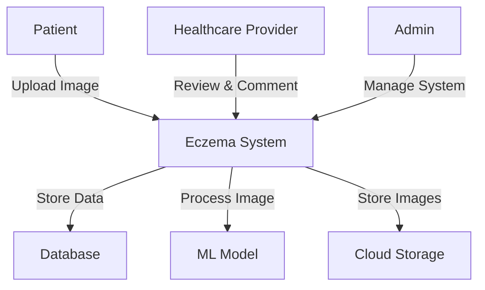
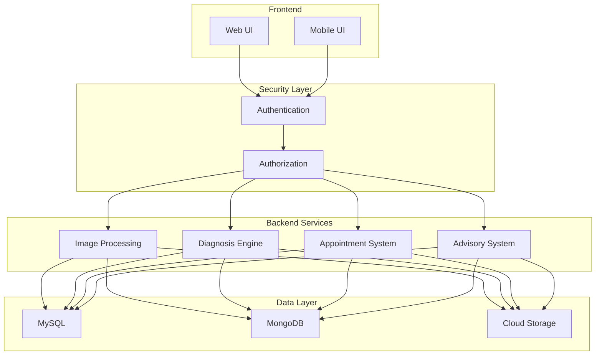
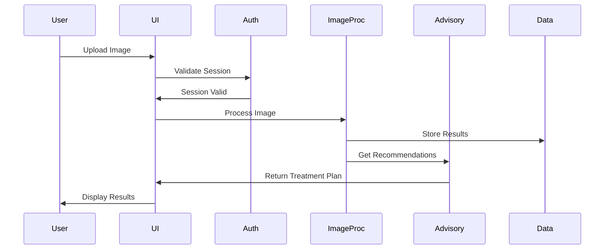
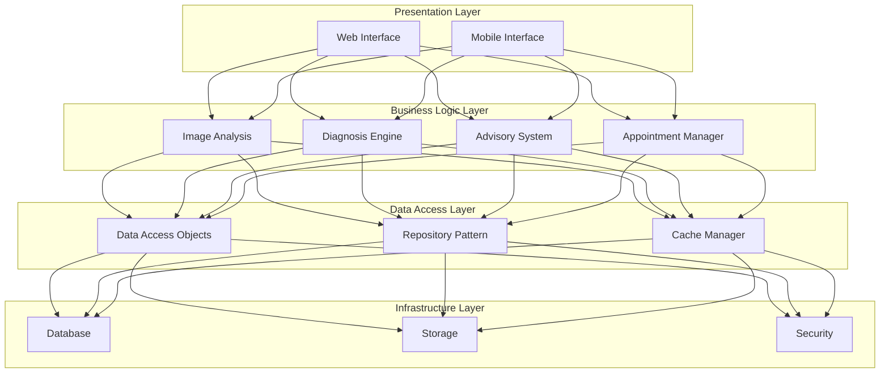
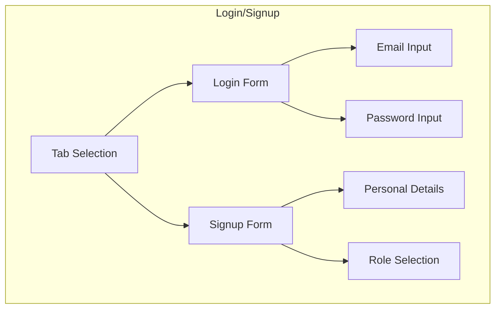
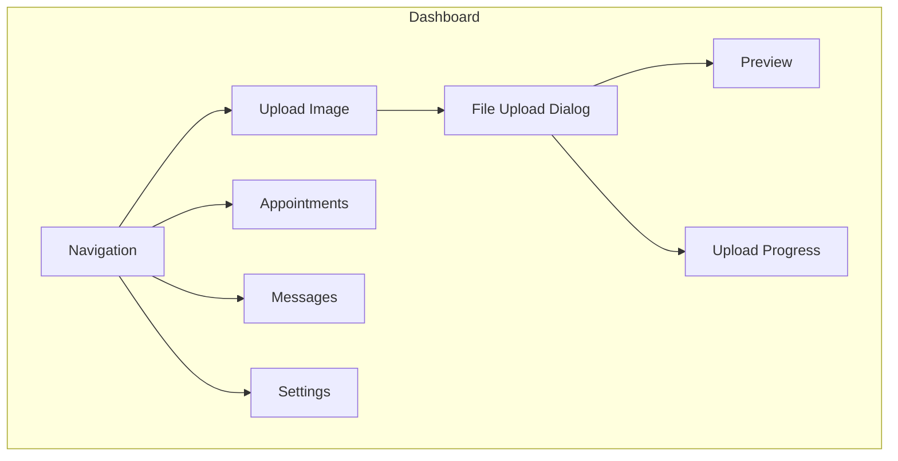
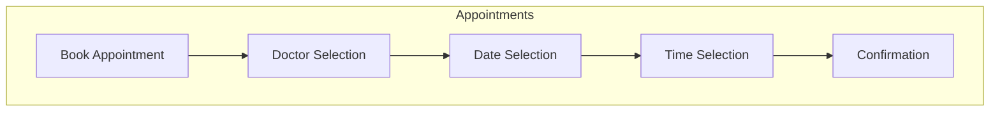

# BSE25-10
# Eczema Diagnosis and Advisory System
# Software Design Document

**Names:** NALUGYA MERISA, MUKISA VANIAH CHRISTIAN, AHEEBWOMUGISHA SASHA ANA, ACAN BRENDA  
**Lab Section:** BSE25-10  
**Workstation:** N/A  
**Date:** 02/01/2025

## Table of Contents
1. [Introduction](#1-introduction)
   1. [Purpose](#11-purpose)
   2. [Scope](#12-scope)
   3. [Overview](#13-overview)
   4. [Reference Material](#14-reference-material)
   5. [Definitions and Acronyms](#15-definitions-and-acronyms)
2. [System Overview](#2-system-overview)
3. [System Architecture](#3-system-architecture)
   1. [Architectural Design](#31-architectural-design)
   2. [Decomposition Description](#32-decomposition-description)
   3. [Design Rationale](#33-design-rationale)
4. [Data Design](#4-data-design)
   1. [Data Description](#41-data-description)
   2. [Data Dictionary](#42-data-dictionary)
5. [Component Design](#5-component-design)
6. [Human Interface Design](#6-human-interface-design)
   1. [Overview of User Interface](#61-overview-of-user-interface)
   2. [Screen Images](#62-screen-images)
   3. [Screen Objects and Actions](#63-screen-objects-and-actions)
7. [Requirements Matrix](#7-requirements-matrix)
8. [Appendices](#8-appendices)

## 1. Introduction

### 1.1 Purpose
This software design document describes the architecture and system design of the Eczema Diagnosis and Advisory System. The intended audience for this document includes:
- Development team
- Project stakeholders
- Healthcare professionals
- System maintainers
- Quality assurance team

### 1.2 Scope
The Eczema Diagnosis and Advisory System aims to assist patients in diagnosing and managing eczema through:
- AI-powered image analysis
- Treatment recommendations
- Healthcare professional consultation
- Patient education and monitoring

**Goals:**
- Facilitate accurate eczema diagnosis
- Reduce treatment costs
- Improve healthcare accessibility
- Enable patient-doctor communication

**Objectives:**
- Implement ML-based image analysis
- Provide treatment recommendations
- Enable appointment scheduling
- Ensure data security and privacy

### 1.3 Overview
This SDD is organized into eight main sections:
1. Introduction - Document purpose and scope
2. System Overview - General functionality description
3. System Architecture - System structure and components
4. Data Design - Data structures and organization
5. Component Design - Detailed component descriptions
6. Human Interface Design - UI/UX specifications
7. Requirements Matrix - Requirements traceability
8. Appendices - Supporting documentation

### 1.4 Reference Material
1. IEEE 1016-2009 - Software Design Descriptions
2. HIPAA Security Rule Requirements
3. GDPR Technical Guidelines
4. HL7 FHIR Standards for Healthcare Data Exchange
5. TensorFlow Documentation for Image Analysis

### 1.5 Definitions and Acronyms
- **API**: Application Programming Interface
- **CRUD**: Create, Read, Update, Delete
- **HIPAA**: Health Insurance Portability and Accountability Act
- **JWT**: JSON Web Token
- **ML**: Machine Learning
- **REST**: Representational State Transfer
- **UI/UX**: User Interface/User Experience

## 2. System Overview

### 2.1 System Context Diagram



### 2.2 System Dependencies

1. External Services
   - Google Cloud Platform
   - TensorFlow Model Server
   - OAuth 2.0 Authentication
   - SMS Gateway for Notifications

2. Third-Party Libraries
   - React.js 18.0
   - TensorFlow.js 2.x
   - Material-UI 5.x
   - MongoDB Driver 5.0

### 2.3 System Constraints

1. Technical Constraints
   - Mobile app limited to Android platform
   - Image size limit: 10MB
   - Maximum concurrent users: 500

2. Business Constraints
   - HIPAA compliance requirements
   - Data retention policies
   - User data privacy regulations

## 3. System Architecture

### 3.1 Architectural Overview

The Eczema Diagnosis and Advisory System employs a modular architectural style, dividing the system into independent, self-contained modules. This approach enables:
- Loose coupling between components
- High cohesion within modules
- Scalable and maintainable codebase
- Clear separation of concerns

#### System Architecture Diagram



### 3.2 High-Level Subsystems

#### 1. User Interface (UI) Subsystem
- **Responsibilities:**
  - Profile management
  - Image upload interface
  - Diagnosis results display
  - Appointment scheduling
- **Technologies:**
  - React.js for web
  - React Native for mobile
  - Material-UI components

#### 2. Image Processing and Diagnosis Subsystem
- **Responsibilities:**
  - Image preprocessing
  - ML model inference
  - Confidence score calculation
- **Technologies:**
  - TensorFlow for ML
  - OpenCV for image processing
  - GPU acceleration support

#### 3. Healthcare Appointment Subsystem
- **Responsibilities:**
  - Appointment scheduling
  - Calendar management
  - Notification system
- **Technologies:**
  - Calendar API integration
  - Real-time updates
  - SMS/Email notifications

#### 4. Advisory and Treatment Subsystem
- **Responsibilities:**
  - Treatment recommendations
  - Lifestyle suggestions
  - Research-based insights
- **Technologies:**
  - Knowledge base system
  - Rule engine
  - Content management system

#### 5. Data Management Subsystem
- **Responsibilities:**
  - Data persistence
  - Backup management
  - Data encryption
- **Technologies:**
  - MySQL for structured data
  - MongoDB for unstructured data
  - Google Cloud Storage

#### 6. Authentication and Security Subsystem
- **Responsibilities:**
  - User authentication
  - Access control
  - Data protection
- **Technologies:**
  - OAuth 2.0
  - JWT tokens
  - AES-256 encryption

### 3.3 Subsystem Interactions



### 3.4 Design Rationale

#### Architecture Selection Criteria
1. **Scalability**
   - Independent scaling of subsystems
   - Horizontal scaling capability
   - Load balancing support

2. **Maintainability**
   - Modular updates possible
   - Clear component boundaries
   - Easy testing and debugging

3. **Security**
   - Layered security approach
   - Data compartmentalization
   - Access control at multiple levels

4. **Performance**
   - Microservices for intensive tasks
   - Caching strategies
   - Optimized data access

5. **Technology Flexibility**
   - Technology-agnostic interfaces
   - Best-fit technology selection
   - Future upgrade path

#### Alternative Architectures Considered

1. **Monolithic Architecture**
   - Rejected due to:
     - Limited scalability
     - Difficult maintenance
     - Technology lock-in

2. **Serverless Architecture**
   - Rejected due to:
     - Cold start latency
     - Complex state management
     - Cost unpredictability

3. **Pure Microservices**
   - Rejected due to:
     - Operational complexity
     - Network overhead
     - Development complexity

### 3.5 Decomposition View



## 4. Data Design

### 4.1 Data Description

The system uses a combination of structured and unstructured data storage solutions:
- MySQL for structured data (patient profiles, appointment schedules)
- MongoDB for unstructured data (image files, diagnosis results)
- Google Cloud Storage for image storage

### 4.2 Data Dictionary

| Field Name | Data Type | Description |
|------------|-----------|-------------|
| patient_id | int | Unique patient identifier |
| image_id | int | Unique image identifier |
| diagnosis_result | string | Diagnosis result (eczema severity) |
| treatment_recommendation | string | Treatment recommendation |
| appointment_schedule | datetime | Appointment schedule |

## 5. Component Design

### 5.1 Core Components

#### 5.1.1 Image Processing Component
```python
class ImageProcessor:
    def preprocess_image(self, image: Binary) -> Dict:
        """
        Preprocess uploaded image for analysis
        """
        try:
            # Validate image format
            if not self._validate_format(image):
                raise InvalidFormatError
                
            # Resize image
            resized = self._resize_image(image, (224, 224))
            
            # Normalize pixels
            normalized = self._normalize_pixels(resized)
            
            # Check quality
            quality_score = self._assess_quality(normalized)
            if quality_score < self.QUALITY_THRESHOLD:
                raise QualityTooLowError
                
            return {
                'processed_image': normalized,
                'quality_score': quality_score,
                'metadata': self._extract_metadata(image)
            }
        except Exception as e:
            log_error(e)
            raise ProcessingError(str(e))
```

#### 5.1.2 Diagnosis Component
```python
class DiagnosisGenerator:
    def generate_diagnosis(self, processed_image: Array) -> Dict:
        """
        Generate eczema diagnosis from processed image
        """
        try:
            # Load ML model
            model = self._load_model()
            
            # Generate prediction
            prediction = model.predict(processed_image)
            
            # Process results
            diagnosis = {
                'severity': self._determine_severity(prediction),
                'confidence': self._calculate_confidence(prediction),
                'affected_areas': self._identify_areas(prediction),
                'recommendations': self._generate_recommendations(prediction)
            }
            
            return diagnosis
        except Exception as e:
            log_error(e)
            raise DiagnosisError(str(e))
```

## 6. Human Interface Design

### 6.1 Overview of User Interface

The system implements a modern, responsive interface using Material-UI (MUI) components, ensuring a consistent and intuitive user experience across all devices. The interface is divided into three main user roles, each with specific functionalities tailored to their needs:

#### 1. Patient Interface

From a patient's perspective, the system provides a comprehensive self-service platform for eczema diagnosis and management:

- **Authentication**
  - Users begin by creating an account or logging in using their email
  - First-time users select their role (patient) during registration
  - Password reset functionality available via email verification
  - Secure session management with automatic timeout

- **Dashboard**
  - Upon login, patients see their personalized dashboard
  - Recent diagnosis history displayed as cards with severity indicators
  - Upcoming appointments shown with countdown timers
  - Quick action buttons for common tasks (New Diagnosis, Book Appointment)
  - Real-time notifications for appointment updates and doctor messages

- **Diagnosis Management**
  - Patients can initiate a new diagnosis by clicking "New Diagnosis"
  - Multiple image upload supported with drag-and-drop interface
  - Real-time image preview before submission
  - Progress bar shows upload and analysis status
  - Results presented with:
    * Severity level with confidence score
    * Affected area identification
    * Treatment recommendations
    * Option to schedule doctor consultation

- **Appointment System**
  - Interactive calendar for selecting appointment dates
  - Available time slots shown based on doctor schedules
  - Simple form for describing symptoms or concerns
  - Confirmation email sent after booking
  - Option to reschedule or cancel with 24-hour notice

#### 2. Doctor Interface

Healthcare providers interact with the system through a specialized interface designed for efficient patient management:

- **Patient Management**
  - Dashboard shows today's appointments and pending reviews
  - Searchable patient list with filtering options
  - Detailed patient history view including:
    * Previous diagnoses with images
    * Treatment history
    * Appointment records
  - Ability to add notes and update treatment plans

- **Appointment Management**
  - Weekly and monthly calendar views
  - Color-coded appointments by type
  - Quick actions to approve/reject appointment requests
  - Ability to set recurring availability slots
  - Emergency slot management

- **Communication**
  - Real-time messaging with patients
  - Template responses for common situations
  - File and image sharing capabilities
  - Notification system for urgent cases
  - Automated appointment reminders

#### 3. Admin Interface

System administrators have access to powerful management tools:

- **User Management**
  - Comprehensive user administration dashboard
  - Bulk user import/export capabilities
  - Role-based access control management
  - User activity monitoring
  - Account status management (activate/deactivate)

The system provides immediate feedback through:
- Success/error messages for all actions
- Loading indicators for processing tasks
- Real-time status updates
- Email notifications for important events
- System status notifications

Security and privacy are maintained through:
- Role-based access restrictions
- Audit logging of all sensitive operations
- Data encryption in transit and at rest
- Session timeout after inactivity
- Two-factor authentication for sensitive operations

### 6.2 Screen Images

#### Login/Signup Screen


#### Patient Dashboard


#### Appointment Management


### 6.3 Screen Objects and Actions

#### 1. Login/Signup Screen
- **Objects:**
  - Email TextField
  - Password TextField
  - Role Selection Dropdown
  - Submit Button
  - Error Alert
  - Loading Progress

- **Actions:**
  - Toggle between login/signup
  - Input validation
  - Form submission
  - Error handling

#### 2. File Upload Dialog
- **Objects:**
  - File Input Button
  - Drop Zone
  - File List
  - Progress Bar
  - Upload Button
  - Cancel Button

- **Actions:**
  - File selection
  - File preview
  - File removal
  - Upload initiation
  - Upload cancellation

#### 3. Appointment Management
- **Objects:**
  - Doctor Selection Dropdown
  - Date Picker
  - Time Picker
  - Reason TextField
  - Submit Button
  - Appointment List

- **Actions:**
  - Doctor selection
  - Date/time selection
  - Appointment booking
  - Appointment cancellation
  - Status updates

#### 4. Navigation
- **Objects:**
  - Sidebar Menu
  - User Profile
  - Notification Bell
  - Settings Icon

- **Actions:**
  - Menu navigation
  - Profile viewing/editing
  - Notification checking
  - Settings adjustment

#### 5. Messaging Center
- **Objects:**
  - Message List
  - Chat Window
  - Contact List
  - Message Input

- **Actions:**
  - Message sending
  - Message reading
  - Contact selection
  - File attachment

All interfaces are implemented using Material-UI components, ensuring a consistent look and feel across the application. The design follows Material Design principles for spacing, typography, and color usage. Real-time updates are handled through WebSocket connections, providing immediate feedback for user actions.

## 7. Requirements Matrix

| Req ID | Description | Component | Status | Priority |
|--------|-------------|-----------|---------|----------|
| FR-1 | User Registration | AuthSystem | Complete | High |
| FR-2 | Image Upload | ImageProcessor | Complete | High |
| FR-3 | Diagnosis Generation | MLEngine | In Progress | High |
| FR-4 | Appointment Booking | AppointmentManager | Complete | Medium |
| FR-5 | Treatment Recommendations | AdvisorySystem | Complete | Medium |
| FR-6 | User Dashboard | UISystem | Complete | High |
| FR-7 | Data Export | DataManager | Planned | Low |
| FR-8 | Notification System | NotificationService | In Progress | Medium |

## 8. Appendices

### A. Technology Stack
- Frontend: React.js 18.0
- Backend: Node.js 16.x
- Database: MySQL 8.0, MongoDB 5.0
- ML Framework: TensorFlow 2.x
- Cloud: Google Cloud Platform

### B. API Documentation
[API documentation would be included here]

### C. Database Schema
[Detailed database schema would be included here]

### D. Security Measures
- AES-256 encryption
- JWT authentication
- Role-based access control
- Regular security audits

### E. Performance Benchmarks
- Image processing: < 5s
- API response: < 2s
- Concurrent users: 500+
- Uptime: 99.9%
